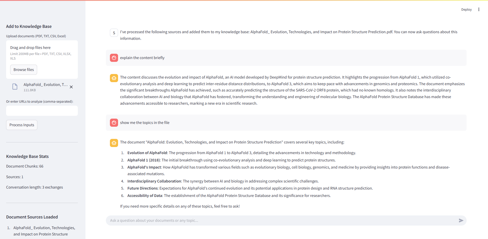

## Screenshot



## 🚀 Features

- **Document & URL ingestion:** Process PDFs, text files, CSVs, Excel, and web pages.
- **Semantic retrieval:** Relevant context found using FAISS and OpenAI embeddings.
- **Web search fallback:** Automatic Google/web search if relevant context is missing or outdated.
- **Chat with memory:** Maintains conversation history and context across turns.
- **Source-aware responses:** Tells you which document or URL the answer comes from.
- **Multi-modal input:** Upload multiple files or URLs at once.

### 3. Set up your OpenAI API key

- **Create a `.env` file** in the project root with your OpenAI API key:

  ```env
  OPENAI_API_KEY=sk-...
  ```